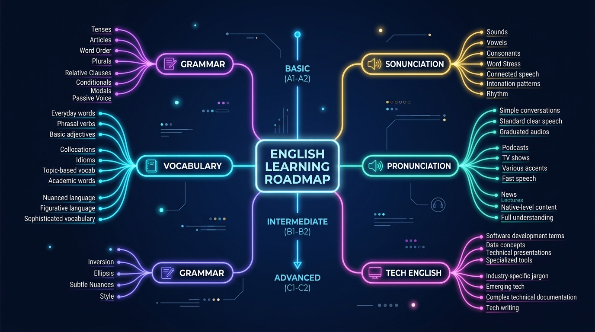

# 🧠 Meu Segundo Cérebro em IA: Aprendizado de Inglês (Básico ao Avançado)

> **Projeto do Desafio DIO:** Criando um Segundo Cérebro com IA no Gemini Notebook (NotebookLM)  
> **Desenvolvido por:** [Elizeu Couto](https://github.com/Elizeu-Couto)  
> **Ferramenta:** [Gemini Notebook (NotebookLM - Google)](https://notebook.google.com/)  
> **Link do Meu Notebook:** [Acessar Meu Gemini Notebook de Inglês](https://notebook.google.com/) *(Cole aqui o link público do seu notebook)*

---

## 🎯 Por que escolhi este Tema e qual meu Objetivo?

Escolhi montar meu segundo cérebro focado no **aprendizado do idioma inglês** porque dominar o inglês — desde a base gramatical até o vocabulário técnico da área de tecnologia — é indispensável para minha evolução profissional e para me comunicar em ambientes globais.

* **Meu Objetivo em 1 Frase:**  
  *"Construir um tutor especialista interativo em língua inglesa capaz de me guiar do nível básico ao avançado através de fontes confiáveis curadas por mim, fornecendo explicações gramaticais com citações exatas, listas de vocabulário contextual, testes interativos e materiais práticos de pronúncia."*

---

## 📚 Como escolhi as Fontes e por que confio nela?

Em vez de pegar qualquer vídeo solto na internet, fiz as buscas por vídeos em **aba anônima** do navegador para evitar que o algoritmo do YouTube escolhesse por mim. Selecionei apenas fontes de instituições consagradas e especialistas com autoridade reconhecida:

| Fonte Selecionada | Formato | Criador / Instituição | Por que decidi incluir? |
|-------------------|---------|-----------------------|-------------------------|
| **BBC Learning English** | Vídeo / Transcrição | BBC World Service | É a maior referência pública de ensino de inglês britânico do mundo. Garante explicações gramaticais precisas. |
| **Cambridge CEFR Companion Guide** | PDF | Cambridge Assessment | A Cambridge é coautora da escala CEFR (A1 a C2). É o padrão oficial usado em exames de proficiência. |
| **Rachel's English** | Vídeo / Transcrição | Rachel's English | Excelente para entender o Alfabeto Fonético (IPA) e perder o receio da pronúncia no inglês americano. |
| **Oxford Online English** | Artigo / Vídeo | Oxford Online English | Focado em conversas reais de trabalho, reuniões e comunicação profissional. |
| **Tech English Guide** | PDF / Texto | MIT OCW / OpenStax | Traz o vocabulário exato de tecnologia (code review, deploy, bottleneck, workaround) que uso no dia a dia. |

> 📌 *Veja minha análise completa de exclusão e inclusão de fontes em [`docs/fontes_curadas.md`](docs/fontes_curadas.md).*

---

## 🤖 Como instruí o Gemini Notebook (Minha Diretriz)

Para transformar o notebook em um tutor exigente e didático, configurei a seguinte instrução no painel de comportamento:

```text
Você é o meu tutor de inglês pessoal. Sua função é me guiar do nível básico ao avançado com base EXCLUSIVAMENTE nas fontes que eu adicionei.

Regras que você deve seguir:
1. Sempre mostre de qual fonte (vídeo ou PDF) você tirou a resposta.
2. Explique os conceitos em português, mas me dê os exemplos e frases práticas em inglês.
3. Quando eu errar no chat, me corrija com gentileza e mostre a regra gramatical correspondente.
4. Quando eu pedir, me dê exercícios rápidos de fixação ou termos de inglês técnico.
```

> 📌 *Veja o documento completo da diretriz em [`docs/diretriz_comportamento.md`](docs/diretriz_comportamento.md).*

---

## 💬 Testando o Notebook no Chat (Exemplos Reais com Citação)

Fiz algumas perguntas no chat para testar se a IA estava realmente respondendo com base nas fontes adicionadas:

### ❓ Minha Pergunta 1 (Gramática B1):
> *"Qual a diferença prática entre 'I have worked here since 2020' e 'I worked here in 2020'?"*

#### 🤖 Resposta do Notebook:
> 1. **"I have worked here since 2020" (Present Perfect):** Você começou em 2020 e **continua trabalhando lá hoje**.
> 2. **"I worked here in 2020" (Past Simple):** Ação concluída no passado. Você **não trabalha mais lá**.
> 
> 📌 **De onde veio a resposta:**  
> - *Fonte: BBC Learning English (Módulo de Present Perfect vs Past Simple)*  
> - *Fonte: Cambridge CEFR Companion Guide (Descritores B1)*

---

### ❓ Minha Pergunta 2 (Pronúncia A1/A2):
> *"Como pronuncio o 'th' em 'think' e 'this'?"*

#### 🤖 Resposta do Notebook:
> - Em **"think"** o som é desvozeado (/θ/): língua nos dentes soltando só o ar.  
> - Em **"this"** o som é vozeado (/ð/): a mesma posição da língua, mas fazendo a garganta vibrar.  
> 
> 📌 **De onde veio a resposta:**  
> - *Fonte: Rachel's English (Aula: The Two TH Sounds)*

> 📌 *Confira o log completo com mais perguntas e a matriz de rastreabilidade em [`evidencias/prints_chat_citacoes.md`](evidencias/prints_chat_citacoes.md).*

---

## 🎨 Materiais de Estudo que Criei no Estúdio

Aproveitei os recursos do Estúdio para gerar materiais práticos que posso usar no meu dia a dia fora da tela:

1. 🗺️ **Mapa Mental:** Criado em [`materiais/mapa_mental.md`](materiais/mapa_mental.md) e visualmente em [`materiais/mapa_mental.jpg`](materiais/mapa_mental.jpg).
2. 📊 **Slides de Estudo:** Disponível em [`materiais/slides_guia_estudos.md`](materiais/slides_guia_estudos.md).
3. 📖 **Guia com Quiz e Glossário Tech:** Criado em [`materiais/guia_estudos_quiz_glossario.md`](materiais/guia_estudos_quiz_glossario.md).
4. 🎙️ **Roteiro de Podcast em Áudio:** Criado em [`materiais/roteiro_podcast_audio.md`](materiais/roteiro_podcast_audio.md).

---

## 🖼️ Visualização do Mapa Mental



---

## 💡 O que Aprendi Construindo este Segundo Cérebro

1. **Curadoria é tudo:** Não adianta jogar 50 PDFs aleatórios. É melhor ter 5 fontes de alta qualidade que respondem com precisão.
2. **Citações dão segurança:** Saber exatamente de qual aula ou documento veio a explicação evita que eu decore regras erradas.
3. **Estudo ativo:** Usar a IA para gerar quizzes e explicar termos de tecnologia tornou o aprendizado muito mais prático para minha rotina.

---

## ✅ Checklist de Submissão DIO

Antes de submeter o repositório na plataforma da DIO, verifiquei todos os itens de qualidade exigidos:

- [x] Cada resposta citada no README mostra de qual fonte veio.
- [x] O repositório está em uma conta pública no GitHub.
- [x] O nome do repositório está legível, em minúsculas e sem acento/caracteres especiais (`segundo-cerebro-ingles-gemini-notebook`).
- [x] Todos os arquivos citados no README me pertencem e têm conteúdo real.
- [x] O link enviado é o do repositório no GitHub.
- [x] Nenhuma fonte possui dados pessoais sensíveis ou materiais protegidos indevidamente.

---

*Projeto desenvolvido por Elizeu Couto para o Desafio de Código da Digital Innovation One (DIO).* 🚀
