# 🗺️ Mapa Mental: Trilha de Aprendizado de Inglês (A1 ao C2)

Este mapa mental sintetiza a jornada completa de aprendizado do idioma inglês, organizada por níveis do **CEFR (Quadro Comum Europeu de Referência)**, integrando pilares gramaticais, fonética, fluência e vocabulário técnico.

---

## 📸 Visual do Mapa Mental

---

## 📊 Estrutura Mermaid Interativa

```mermaid
graph TD
    Root["🇬🇧 English Learning Roadmap (CEFR Framework)"]

    %% Nível Básico (A1 - A2)
    Root --> Basic["1. Básico (A1 - A2) Foundation"]
    Basic --> BasicGrammar["Gramática Essencial<br/>• Verbo To Be & Simple Present<br/>• Past Simple & Regular/Irregular Verbs<br/>• Pronouns & Articles (a/an/the)"]
    Basic --> BasicVocab["Vocabulário do Dia a Dia<br/>• Cumprimentos e Apresentações<br/>• Números, Horas e Rotinas<br/>• Descrição de Lugares e Objetos"]
    Basic --> BasicPhonetics["Pronúncia Inicial<br/>• Sons de Vogais Curtas e Longas<br/>• Alfabeto e Spelling"]

    %% Nível Intermediário (B1 - B2)
    Root --> Interm["2. Intermediário (B1 - B2) Independence"]
    Interm --> IntermGrammar["Gramática Intermediária<br/>• Present Perfect vs Past Simple<br/>• Modal Verbs (can, could, should, must)<br/>• Conditionals (0, 1st, 2nd, 3rd)<br/>• Relative Clauses (who, which, that)"]
    Interm --> IntermVocab["Vocabulário Expandido<br/>• Phrasal Verbs Essenciais<br/>• Idioms & Expressões Idiomáticas<br/>• Opiniões e Argumentação"]
    Interm --> IntermListening["Listening e Pronúncia<br/>• Connected Speech (linking words)<br/>• Entonação e Stress nas Frases"]

    %% Nível Avançado (C1 - C2)
    Root --> Adv["3. Avançado (C1 - C2) Mastery"]
    Adv --> AdvGrammar["Estruturas Complexas<br/>• Inversão Gramatical (Hardly had I...)<br/>• Subjuntivo e Mixed Conditionals<br/>• Discourse Markers & Transições"]
    Adv --> AdvFluency["Fluência Natural<br/>• Nuances Culturais e Humor<br/>• Negociação e Debate Fluido<br/>• Redação Acadêmica e Formal"]

    %% Trilha Especial: Tech English
    Root --> Tech["4. 💻 Tech & Professional English"]
    Tech --> TechTerms["Vocabulário Técnico<br/>• Code Review & Bug Reports<br/>• Cloud, Architecture & DevOps<br/>• Agile Ceremonies (Daily, Sprint)"]
    Tech --> TechSoft["Soft Skills em Inglês<br/>• Technical Presentations<br/>• Job Interviews & Salary Negotiation<br/>• Asynchronous Communication (Slack/GitHub)"]
```

---

## 📌 Descrição dos Módulos

### 🔵 Nível Básico (A1 - A2)
* **Objetivo:** Estabelecer a base estrutural e ganhar confiança nas primeiras interações.
* **Foco:** Entender estruturas de frases simples (Sujeito + Verbo + Objeto), perguntar e responder sobre rotinas diárias e dominar os números e saudações.

### 🟡 Nível Intermediário (B1 - B2)
* **Objetivo:** Adquirir independência comunicativa em situações familiares e profissionais.
* **Foco:** Dominar tempos verbais compostos (Present Perfect), formular hipóteses (Conditionals) e utilizar *Phrasal Verbs* com naturalidade.

### 🔴 Nível Avançado (C1 - C2)
* **Objetivo:** Alcançar a maestria, precisão gramatical e adaptação espontânea a qualquer contexto.
* **Foco:** Uso refinado de marcadores de discurso, inversões estilísticas, redação técnica sofisticada e compreensão total de nativos.

### 💻 Trilha Tech English (Profissional)
* **Objetivo:** Capacitar o estudante para trabalhar em times globais e internacionais de tecnologia.
* **Foco:** Comunicação assíncrona no Slack/GitHub, participação ativa em *Dailies* e *Sprint Reviews*, e redação clara de documentações e chamados.
